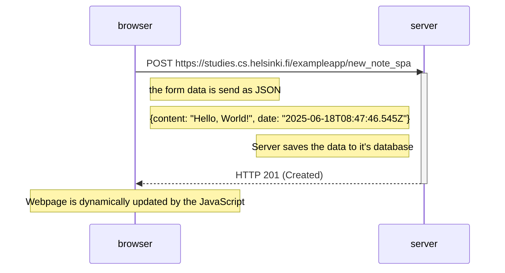

```mermaid
sequenceDiagram 
  participant browser
  participant server

  browser->>server: POST https://studies.cs.helsinki.fi/exampleapp/new_note_spa
  activate server
  Note right of browser: the form data is send as JSON 
  Note right of browser: {content: "Hello, World!", date: "2025-06-18T08:47:46.545Z"}
  Note left of server: Server saves the data to it's database 
  server-->>browser: HTTP 201 (Created)
  deactivate server
  Note over browser: Webpage is dynamically updated by the JavaScript

  

```
